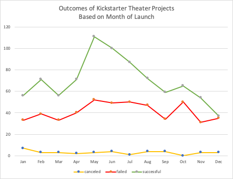
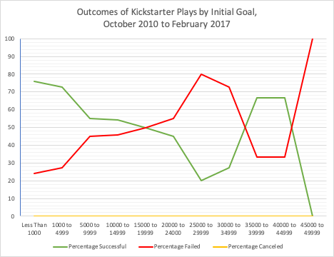
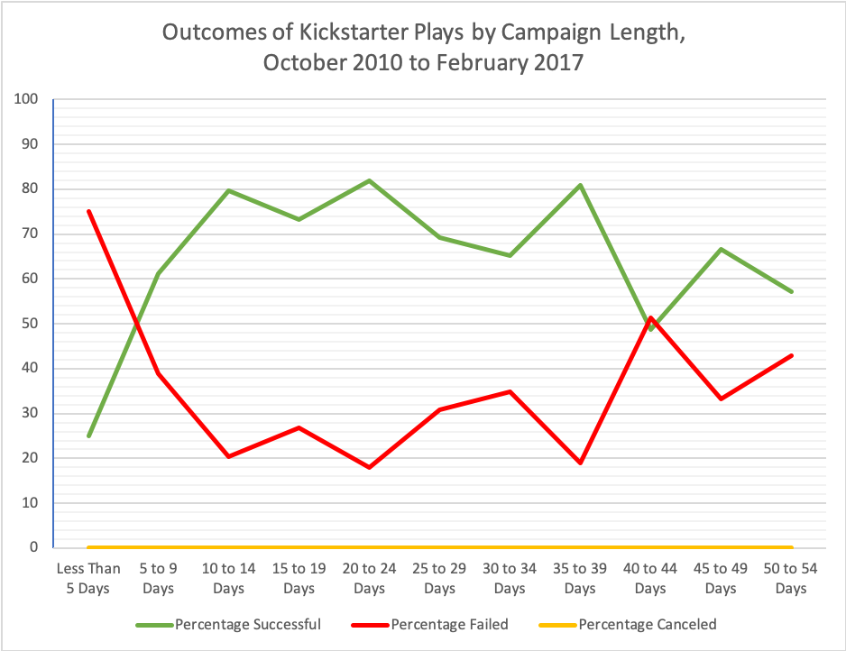

# Kickstarter Analysis
This report has been requested by Louise for the purpose of assisting with increasing the chances of achieving success in her upcoming campaign. This report provides an analsis of historical Kickstater campaing data in order decipher which parameters are most closely correlated with the successful funding of project. Data visualizations accompany the data as necessary.

---

### Challenge
The challenge provided by Louise explicitly mentions that she is intrested in finding out how the length of the campaign impacts is success. Unfortunately, it seems like the detailed instructions and rubric she ultimately provided do not actually indicate a need for such an analysis. 

Because the focus of the reqest is on the results of the projects, those projects that were still live at the time the dataset was collected (i.e, those with the status of "live"), have been omitted from the analysis.

In order to address all implied and explict instructions, the challenge instructions have been followed and additional analysis on campaign length has been included.

#### Conclusions

The two specified charts and the third chart, which was implied in the instruction, demonstrate that there is a noticeable correlation between the outcomes of the projects and the three variables under consideration.  

Perhaps the most marked correlation between success of theatric Kickstarter campaigns and their launch date. Figure 1 charts the month of the project launch and number of funded, failed, and canceled project. A significant peak of funded project occurs in May and the drop-off is not visually any more signficant from other seasonal drops in successes. 

 
**Figure 1.** *Outcomes of Kickstarter Theater Projects Based on Month of Launch*

November, December, and January see relatively low numbers of projects being funded; however, the same time period has lower-than-typical rates of failure.

First, the number of theatrical projects launched between Novemeber and January is noticably lower than the height in May. Furthermore, Figure 1 visually demonstrates that the rate of success decreases. For example, the number of successful and failed campaigns is almost equal in December whereas the number of successful campiagns in May is almost twice the number of failed projects. The reluctance of projects to go forward between November and January is likely linked the Western holidays.

Conversely, the total number of projects peaks in May and tapers off in the months that follow. The reason for this trend could be that, at least in the northern hemisphere, performance seasons generally run from the autumn to the spring. This could mean that, once the season ends, producers are able to focus on new project. While the success rate is generally favorable during this northern hemisphere summer period, there could be a problem with projects getting lost in the sheer number of other projects.

In regards to funding goals, there does not appear to be a linear coorelation, as demonstrated in Figure 2.

 
**Figure 2.** *Outcomes of Kickstarter Play by Initial Goal, October 2010 to February 2017*

Instead there seem to be a few sweet spot. First, projects on the low end of the spectrum have relatively high success rates. The data points in the first three bins are particularly robust and it's easy to see that projects that do not ask for a lot from the project backers. Another sweet spot appears for projects with goals from $35,000 to $44,999. This trend, however, is likely an anomoly. The data for projects with goals of $15,000 or more simply is not that robust. While it is the case that  two-thirds of the projects are successful, that is two-thirds of nine projects As such, the results should be taken with some skepticism. It is likely that the high rate of success for projects in this range is a factor of there being relatively few campaigns and, those that have been started, are of particularly high quality. An anamoly like this would be quite common in situations with relatively litte data.

Finally, the pro bono analysi of yeilds some fine preliminary results. While far from a normal curve, it seems that there is something that resembles a bell in Figure 3.

 
**Figure 3.** *Outcomes of Kickstarter Plays by Campaign Length, October 2010 to February 2017

The middle range of the length of campaigns is higher than either end. The recomendation for Louise would be that she plan to run her campaign from between 15 to 44 days. As her goal is relatively modest, a more specific recomendation is that she go toward the lower end of that range.

#### Limitations
While the analysis of the data seems to present a rather compelling agrument that a musical production Kickstarter campaing should be launched in the month of May with a funding goal toward the low end of the spectrum or approximately in the range of $25,000  to $35,000, with campaign lengths ranging from 10 to 39 days, there are limitaions to the analysis provided.

The most glaring limiation is that different data sets are requested in the instructions. The outcomes by month of launch include all theatrical projects whereas the outcomes by initial goal and campaign length focus specifically on play subset. This isn't the most dire of limitations but it does mean the data cannot be directly compared.

On reason for requesting analysis of all theater projects in one instance and of only plays in another instance could be the amount of data needed for insightful findings&mdash;that the analysis of project by start date simply needed more data points to be useful. This would imply that another limitaion would be the relatively small sample size.

Another limitation that presents itself is that analysis requested for outcomes by month of campaign launch is an analysis by count and not rate. As can be seen in the date, there are simply more campaigns launched in the month of May and those that follow. Fortunately, yhe data is clear enough to read and assess approximate success and failure rate. Neverheless, if the desire is to look beyond the visualization and see fine-grain analysis, that particulay chart will be of little use.

#### Further Questions
First, it should be stated that one outstanding question&mdash;how the length of the campaign affects the success of plays&mdash;would have otherwise been an outstanding question yet the analysis is provided herein this documentation and within the Excek sheed.

Louise's understanding would be futher deepend by combining the analyses. It might be helpful to conduct a multivatiate regression analysis even between the three variables analyzed. In particular, I would suggest combining at least goal and campaign length. Those two variables would, on the surface, appear to have a correlation (e.g., it is reasonable to assume the higher the goal is, the longer the campaign would have to be). However, such a correlation could conceivable be thrown off by paradoxically. For example, a high goal in and of itself could serve to generate buzz whereas proposing a project with a low goal might communicate to backers a lack of faith by the compaign promponents. Analyzing how goal and campaign lenght could provide valuable information to Louise as she decides specificaly how long to run the campagaign for her specific budget. Similarly, a regression analysis considering goal and start date, or even goal, start date, and even campaign length could provide valuable information in campaign planning.

More analyses that could be conducted with data other than that discussed herein would be to consider which variables predict excess funding. Aside from looking at campaign end, it would be very helpful to look at the time it took for successful projects to meet their funding goals.
